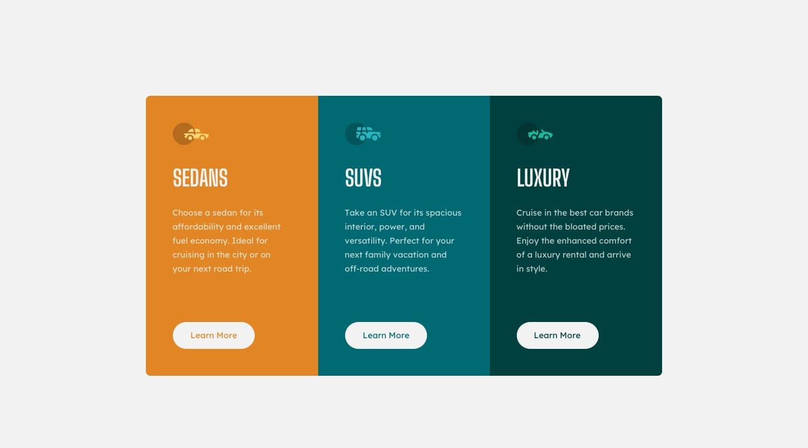

# 🚀 3-column preview card component solution

This is a solution to the [3-column preview card component challenge on Frontend Mentor](https://www.frontendmentor.io/challenges/3column-preview-card-component-pH92eAR2-).

[Frontend Mentor](https://www.frontendmentor.io) challenges help you improve your coding skills by building realistic projects.

## Table of contents

- [The challenge](#the-challenge)
- [My process](#my-process)
  - [Built with](#built-with)
  - [Links](#links)
  - [Screenshots](#screenshots)
  - [What I learned](#what-i-learned)
  - [Continued development](#continued-development)
  - [Useful resources](#useful-resources)
- [Author](#author)
- [Acknowledgments](#acknowledgments)

## The challenge

The challenge is to build out this 3-column preview card component and get it looking as close to the design as possible.

Users should be able to:

- View the optimal layout depending on their device's screen size

<div style="display: flex; gap: 1rem; padding-bottom: 1.5rem;">
  <div>
    
  </div>
  <div>
    
  </div>
</div>

- See hover states for interactive elements

 <div>
    
  </div>

## My Process

### Built with

- **HTML5:** For the semantic structure of the page.
- **CSS3:** For styling the components.
- **Flexbox:** For creating the responsive layout of the card and the overall page.
- **CSS Custom Properties (:root):** For managing color and fonts.
- **BEM Methodology:** For naming CSS classes
- **Mobile-First Workflow:** For design and responsiveness.
- **Git:** For version control.
- **Netlify:** For hosting the project repository.
- **Google Fonts:** For importing the custon fonts used in the design.

### Links

- Solution URL: [Add solution URL here](https://your-solution-url.com)
- Live Site URL: [3 column card component](https://3column-cards-css.netlify.app)

### Screenshots

<div style="display: flex; gap: 1rem; padding-bottom: 1.5rem;">
  <div>
    
  </div>
  <div>
    
  </div>
</div>

### What I learned

- **BEM (Block, Element, Modifier):** This is a naming methodology for CSS classes that helps developers write more maintainable and scalable code. It organizes styles intro three distinct parts:
  - **Block:** A standalone component (e.g. `card`, `button`).
  - **Element:** A part of the block (e.g. `card__title`, `card__icon`).
  - **Modifier:** A flag on a block or element that changes its appearance or behavior (e.g. `card--sedans`, `button--active`).

This approach makes class names clear, modular, and less prone to conflicts.

```html
<section class="card card--sedans">
  
  <h2 class="card__title">Sedans</h2>
  <p class="card__description">
    Choose a sedan for its affordability and excellent fuel economy. Ideal for
    cruising in the city or on your next road trip.
  </p>
  <a class="card__button card__button--sedans" href="#">Learn More</a>
</section>
```

```
Block__Element--Modifier

article cards
  section card card--sedans
    card__icon
    card__title
    card__description
    card__button card__button--sedans
  section card card--suvs
    card__icon
    card__title
    card__description
    card__button card__button--suvs
  section card card--luxury
    card__icon
    card__title
    card__description
    card__button card__button--luxury
```

- **CSS Variables:** I implemented custom CSS properties, also known as CSS variables, to store reusable values. By defining variables in the `:root` pseudo-class (e.g., `--color-primary-cyan`), I can use these values throughout the stylesheet (`var(--color-primary-cyan)`). This approach makes it easy to manage a project's color palette, typography, and spacing, drastically simplifying future updates and ensuring design consistency.

```css
:root {
  /* Colors */
  --color-primary-cyan: hsl(184, 100%, 22%);
}
.card--suvs {
  background-color: var(--color-primary-cyan);
}
```

- **Accesibility (A11y):** I focused on creating an accesible user interface to ensure the component is usable for everyone. My key accesibility practices included:
  - **Semantic HTML:** Using meaningful tags like `<main>`, `<article>`, and `<section>` to provide a clear document structure for screen readers and other assistive technologies.
  - **ARIA Labels:** implementing the `aria-label` attribute on the `<main>` tag to provide a descriptive name for the main content area. This is particularly useful for screen reader users, as it gives context to a landmark element that might not have a visible heading.
  - **Descriptive `alt` attribute:** For the decorative icons, I used an empty `alt=""` attribute. This is crucial practice that tells screen readers to ignore the image, preventing redundant or unnecesary annoucements that could clutter the user's experience. This ensures the focus remains on the main content and not on visual elements that don't convey essential information.

### Continued development

- **Responsive Typography:** While I used thhe `clamp()` function to create fluid typography, I'd like to explore more advanced techniques to ensure font sizes are perfectly responsive across all devices and screen sizes. My goal is to achieve an even more refined and harmonics visual hierarchy.
- **BEM (Block, Element, Modifier):** I successfully implemented the BEM methodology for this project, which greatly improved the clarity and organization of my CSS. In future projects I aim to master its application to even more complex layouts and larger-scale components to write cleaner, more scalable code.

### Useful resources

- **Google Gemini:** Used Gemini as a powerful tool for continuous learning and problem-solving throughout the development process. Its assistance was invaluable for refining my code and understanding new concepts.

## Author

- Frontend Mentor - [@amansgz](https://www.frontendmentor.io/profile/amansgz)
- Github - [@amansgz](https://www.github.com/amansgz)

## Acknowledgments

- **Google Gemini:** I am grateful to Gemini for its invaluable help with the English-language descriptions, which allowed me to articulate my learning process and showcase the project's features more effectively.
