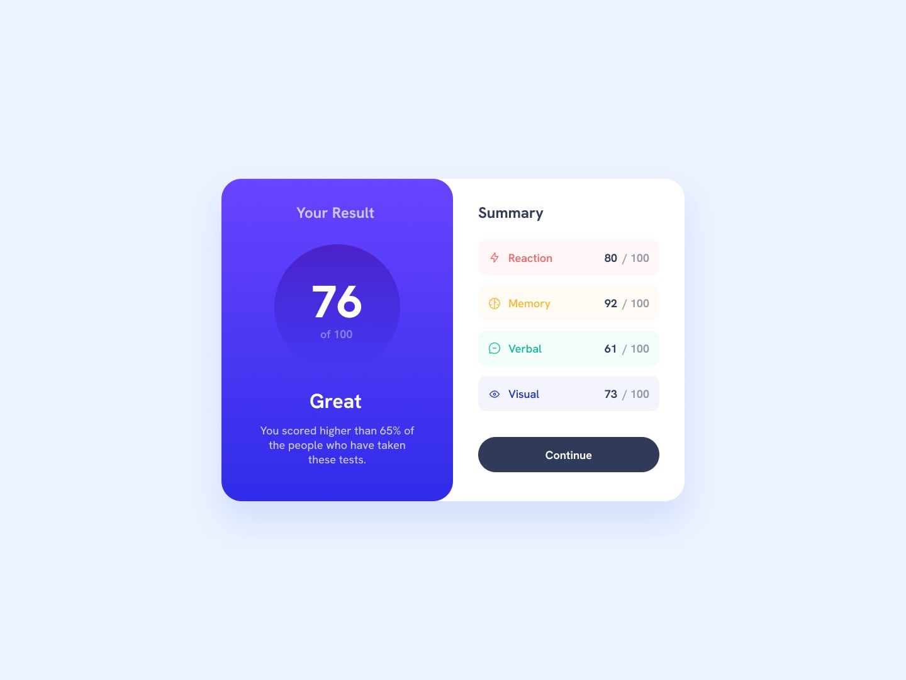

# My Frontend Mentor Solutions

Welcome to my porfolio of solutions for Frontend Mentor challenges.

[Frontend Mentor](https://www.frontendmentor.io) challenges help you improve your coding skills by building realistic projects.

- **QR code component:**

  [Live Site](https://qr-card-solution.netlify.app) | [Code](https://github.com/amansgz/frontend-newbie-solutions/tree/main/qr-code-component)

  

    
  

- **Profile card component:**

  [Live Site](https://profile-card-solution-css.netlify.app) | [Code](https://github.com/amansgz/frontend-newbie-solutions/tree/main/profile-card-component)

  

    
  

- **Order Summary Component:**

  [Live Site](https://order-summary-solution-css.netlify.app) | [Code](https://github.com/amansgz/frontend-newbie-solutions/tree/main/order-summary-component)

  

    
  

- **Product Preview Card Component:**

  [Live Site](https://product-card-solution-css.netlify.app) | [Code](https://github.com/amansgz/frontend-newbie-solutions/tree/main/product-preview-card-component)

  

    
  

- **Stats Preview Card Component:**

  [Live Site](https://stats-preview-component.netlify.app) | [Code](https://github.com/amansgz/frontend-newbie-solutions/tree/main/stats-preview-card-component)

  

    
  

- **NFT Preview Card Component:**

  [Live Site](http://nft-card-css.netlify.app) | [Code](https://github.com/amansgz/frontend-newbie-solutions/tree/main/nft-preview-card-component)

  

    
  

- **3 Column Preview Card:**

  [Live Site](https://3column-cards-css.netlify.app) | [Code](https://github.com/amansgz/frontend-newbie-solutions/tree/main/3-column-preview-card)

  

    
  

- **Single Price Grid Component:**

  [Live Site](https://single-price-grid-solution-css.netlify.app) | [Code](https://github.com/amansgz/frontend-newbie-solutions/tree/main/single-price-grid-component)

  

    
  

- **Four Card Feature Section:**

  [Live Site]() | [Code](https://github.com/amansgz/frontend-newbie-solutions/tree/main/four-card-feature-section)

  

    
  

- **Huddle Landing Page:**

  [Live Site](https://huddle-landing-page-solution-css.netlify.app) | [Code](https://github.com/amansgz/frontend-newbie-solutions/tree/main/huddle-landing-page)

  

    
  

- **Article Preview Component:**

  [Live Site]() | [Code](https://github.com/amansgz/frontend-newbie-solutions/tree/main/article-preview-component)

  

    
  

- **FAQ Accordion Card:**

  [Live Site]() | [Code](https://github.com/amansgz/frontend-newbie-solutions/tree/main/faq-accordion-card)

  

    
  

- **Interactive Rating Component:**

  [Live Site]() | [Code](https://github.com/amansgz/frontend-newbie-solutions/tree/main/interactive-rating-component)

  

    
  

- **Results Summary Component:**

  [Live Site]() | [Code](https://github.com/amansgz/frontend-newbie-solutions/tree/main/results-summary-component)

  

    
  

- **Ping Coming Soon Page:**

  [Live Site]() | [Code](https://github.com/amansgz/frontend-newbie-solutions/tree/main/ping-soming-soon-page)

  

    
  

- **Base Apparel Coming Soon Page:**

  [Live Site]() | [Code](https://github.com/amansgz/frontend-newbie-solutions/tree/main/base-apparel-coming-soon)

  

    
  

- **Intro Component with Form:**

  [Live Site]() | [Code](https://github.com/amansgz/frontend-newbie-solutions/tree/main/intro-component-with-form)

  

    
  

