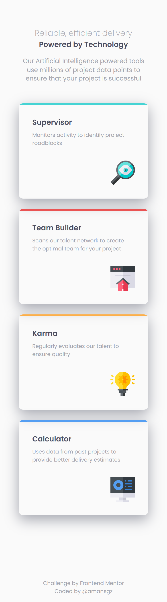
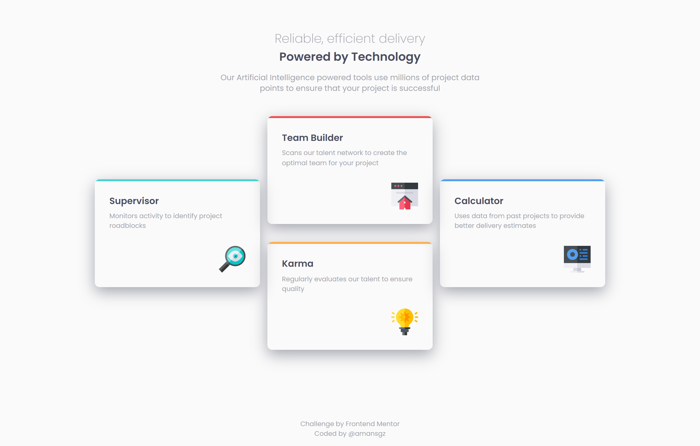

# Four card feature section solution

This is a solution to the [Four card feature section challenge on Frontend Mentor](https://www.frontendmentor.io/challenges/four-card-feature-section-weK1eFYK).

[Frontend Mentor](https://www.frontendmentor.io) challenges help you improve your coding skills by building realistic projects.

## Table of contents

- [The challenge](#the-challenge)
- [My process](#my-process)
  - [Built with](#built-with)
  - [Links](#links)
  - [Screenshots](#screenshots)
  - [What I learned](#what-i-learned)
- [Author](#author)

## The challenge

Users should be able to:

- View the optimal layout for the site depending on their device's screen size

<div style="display: flex; gap: 1rem; padding-bottom: 1.5rem;">
  <div>
    
  </div>
  <div>
    
  </div>
</div>

## My Process

### Built with

- Semantic HTML5 markup
- CSS Custom Properties
- BEM methodology
- Flexbox
- Css Grid
- Mobile-first workflow

### Links

- Solution URL: [Add solution URL here](https://your-solution-url.com)
- Live Site URL: []()

### Screenshots

<div style="display: flex; gap: 1rem; padding-bottom: 1.5rem;">
  <div>
    
  </div>
  <div>
    
  </div>
</div>

### What I learned

- **Card accents using pseudo element:**
  A key learning from this challenge was implementing the distinctive card borders using CSS's `::before` pseudo-element.

```css
.card {
  position: relative;
}
.card::before {
  content: "";
  position: absolute;
  top: 0;
  left: 0;
  width: 100%;
  height: 4px;
}
.card-cyan::before {
  background-color: var(--color-primary-cyan);
}
.card-red::before {
  background-color: var(--color-primary-red);
}
.card-orange::before {
  background-color: var(--color-primary-orange);
}
.card-blue::before {
  background-color: var(--color-primary-blue);
}
```

## Author

- Frontend Mentor - [@amansgz](https://www.frontendmentor.io/profile/amansgz)
- Github - [@amansgz](https://www.github.com/amansgz)
