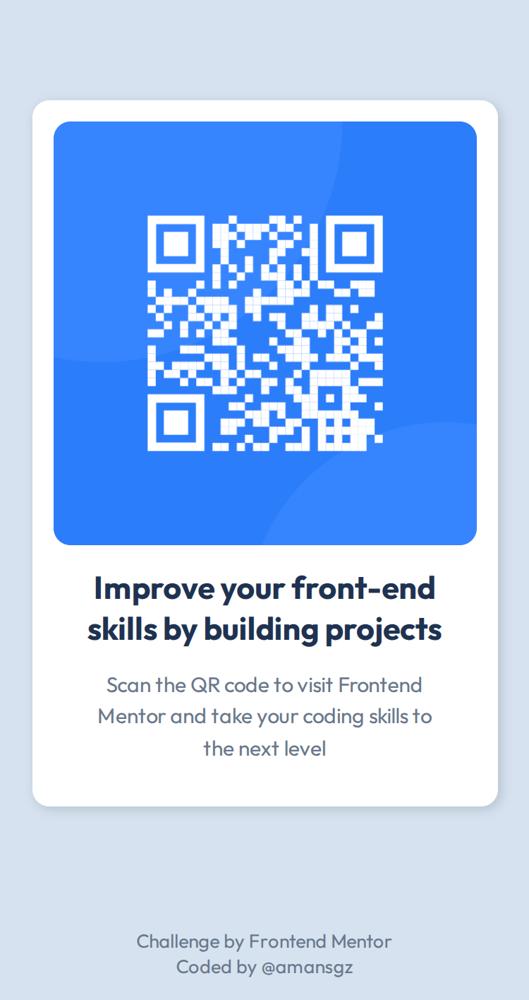
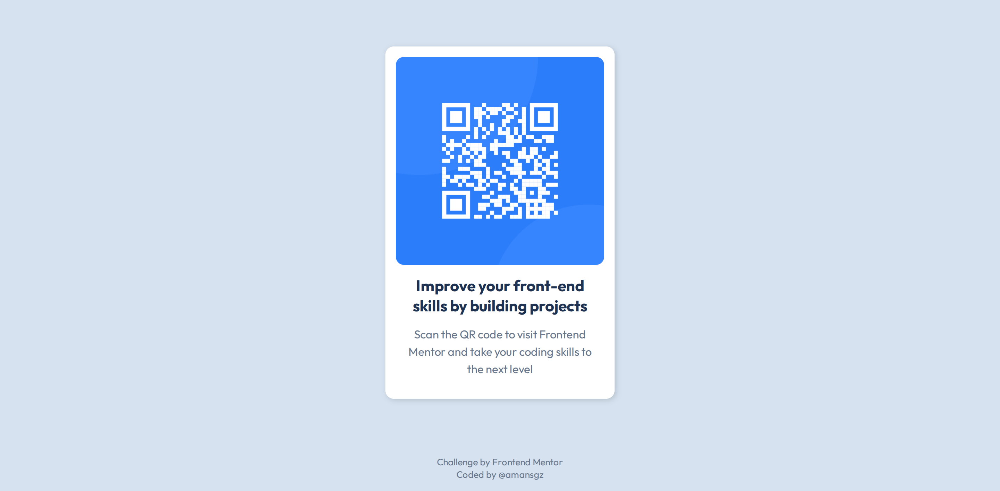

# QR code component solution

This is a solution to the [QR code component challenge on Frontend Mentor](https://www.frontendmentor.io/challenges/qr-code-component-iux_sIO_H).

[Frontend Mentor](https://www.frontendmentor.io) challenges help you improve your coding skills by building realistic projects.

## Table of contents

- [The challenge](#the-challenge)
- [My process](#my-process)
  - [Built with](#built-with)
  - [Links](#links)
  - [Screenshots](#screenshots)
  - [What I learned](#what-i-learned)
- [Author](#author)

## The challenge

The challenge is to build out this QR code component and get it looking as close to the design as possible.

<div style="display: flex; gap: 1rem; padding-bottom: 1.5rem;">
  <div>
    
  </div>
  <div>
    
  </div>
</div>

## My Process

### Built with

- Semantic HTML5 markup
- CSS Custom Properties
- Flexbox
- Mobile-first workflow

### Links

- Solution URL: [Add solution URL here](https://your-solution-url.com)
- Live Site URL: [QR card solution](https://qr-card-solution.netlify.app)

### Screenshots

<div style="display: flex; gap: 1rem; padding-bottom: 1.5rem;">
  <div>
    
  </div>
  <div>
    
  </div>
</div>

### What I learned

- **Responsive Layout:** The component adapts to different screen sizes, providing an optimal viewing experience on both desktop and mobile devices.
- **Perfect Centering:** The QR code card centered both horizontally and vertically on the page using modern Flexbox techniques.

  ```css
  body {
    display: flex;
    flex-direction: column;
    min-height: 100vh;
  }
  main {
    flex-grow: 1;
    display: flex;
    justify-content: center;
    align-items: center;
  }
  ```

- **CSS Variables:** I implemented custom CSS properties, also known as CSS variables, to store reusable values. By defining variables in the `:root` pseudo-class, I can use these values throughout the stylesheet. This approach makes it easy to manage a project's color palette, typography, and spacing, drastically simplifying future updates and ensuring design consistency.

  ```css
  /* Base colors: Main project palette*/
  --slate-300: hsl(212, 45%, 89%);
  --slate-500: hsl(216, 15%, 48%);
  --slate-900: hsl(218, 44%, 22%);
  --white: hsl(0, 0%, 100%);

  /* Purpose colors: Used for specific elements */
  --main-bg: var(--slate-300);
  --card-bg: var(--white);
  --card-title-color: var(--slate-900);
  ```

- **Clean and Accesible Code:** The project uses semantic HTML and includes a screen reader-only heading to improve accessibility and provide proper context for assistive technologies.

  ```css
  /* Utilities */
  .sr-only {
    /* 
    Visually hides element but keeps it 
    accesible for screen readers 
    */
    position: absolute;
    width: 1px;
    height: 1px;
    padding: 0;
    margin: -1px;
    overflow: hidden;
    clip: rect(0, 0, 0, 0);
    white-space: nowrap;
    border-width: 0;
  }
  ```

## Author

- Frontend Mentor - [@amansgz](https://www.frontendmentor.io/profile/amansgz)
- Github - [@amansgz](https://www.github.com/amansgz)
