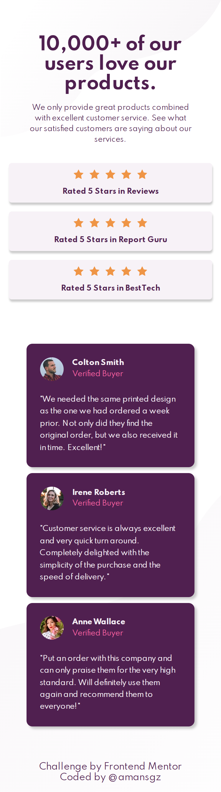
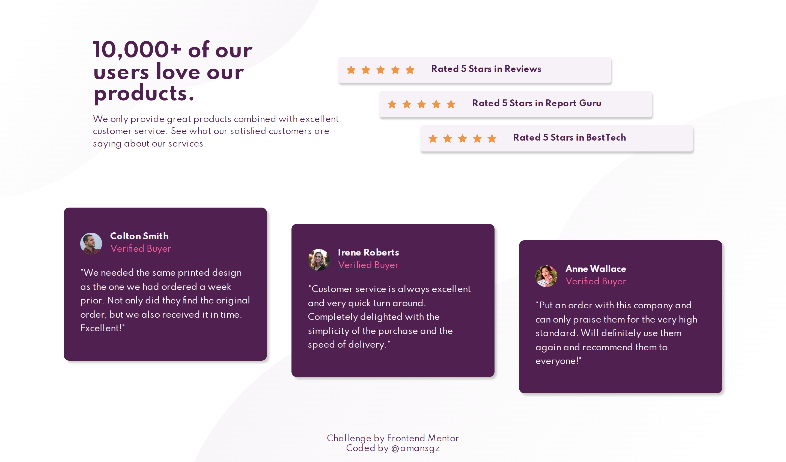

# Social proof section solution

This is a solution to the [Social proof section challenge on Frontend Mentor](https://www.frontendmentor.io/challenges/social-proof-section-6e0qTv_bA).

[Frontend Mentor](https://www.frontendmentor.io) challenges help you improve your coding skills by building realistic projects.

## Table of contents

- [The challenge](#the-challenge)
- [My process](#my-process)
  - [Built with](#built-with)
  - [Links](#links)
  - [Screenshots](#screenshots)
  - [What I learned](#what-i-learned)
- [Author](#author)

## The challenge

Your challenge is to build out this social proof section and get it looking as close to the design as possible.

Users should be able to:

- View the optimal layout for the section depending on their device's screen size

  

    
  

  

    
  

## My Process

### Built with

- Semantic HTML5 markup
- CSS custom properties
- Flexbox
- Mobile-first workflow
- JavaScript

### Links

- Solution URL: [Add solution URL here](https://your-solution-url.com)
- Live Site URL: 

### Screenshots

  

    
  

  

    
  

### What I learned

- **Staircase effect implementation:** Using CSS `nth-child` selectors combined with `margin` to create a visually appealing staircase effect.
- **Dynamic star rating generation:** Creating SVG star elements for all rating components. This approach allows easy scalability if different ratings were needed in the future.

## Author

- Website - [Add your name here](https://www.your-site.com)
- Frontend Mentor - [@amansgz](https://www.frontendmentor.io/profile/amansgz)
- Github - [@amansgz](https://www.github.com/amansgz)
